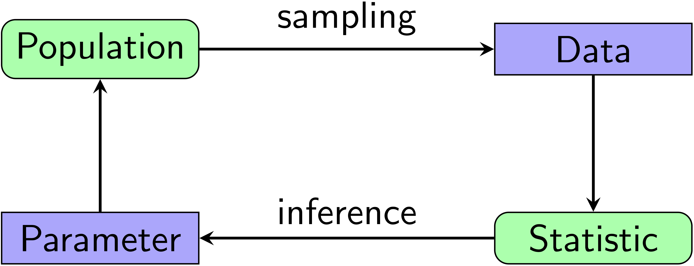
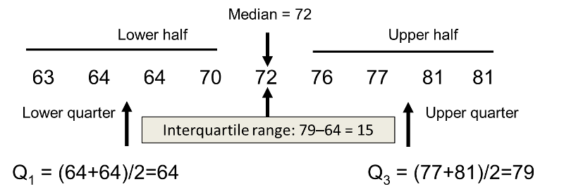
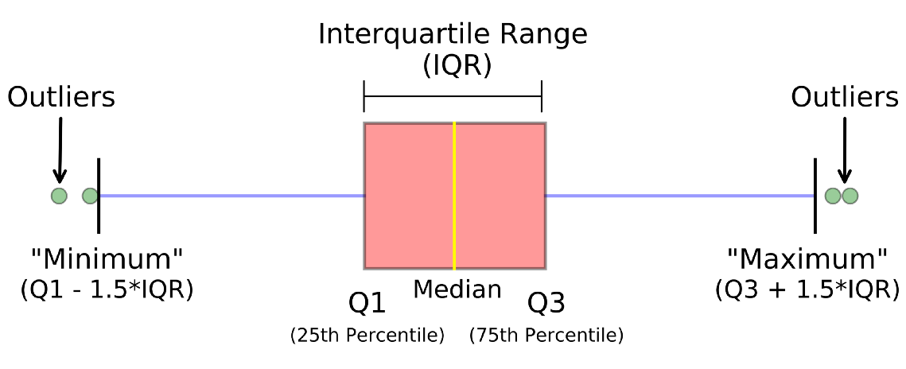
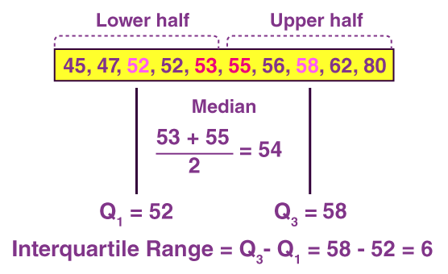

# (PART) Statistics {-}

# Introduction to statistics

In this chapter, we will learn about how to use statistics to analyze data.


## Inferential statistics

Inferential statistics is all about using a *sample* to make inferences about the *population* from which the sample was drawn. For example, we might want to check if the efficacy of the Pfizer vaccine is better than that of the Moderna vaccine for preventing COVID-19 (spoiler alert: it's not!).

```{r inferences, out.width="65%", fig.align="center", fig.cap="A visualization of inferential statistics.", echo=FALSE}

```

<button class="collapsible">Sampling bias and sampling error</button>
<div class="collapse_content">
In inferential statistics, there are two main types of errors: sampling bias and sampling error. Both describe how there are differences between the sample and the population.

1. Sampling bias: your sample may not be representative of the population.
1. Sampling error: the difference between a sample and population value (e.g., you measure the heights of a sample to be 160 cm when the population height is in fact 155 cm).
</div>


## Measures of central tendency

---

**Measures of central tendency.** The three measures of central tendency are your mean, median, and mode.

1. Mean: the arithmetic average.
1. Median: a value that splits ordered data into two equal halves.
1. Mode: the most frequent value in a dataset.

---

```{r central-tendency, out.width="85%", fig.align="center", fig.cap="A visualization of measures of central tendency. Figure retrieved from this [Medium Digest article](https://codeburst.io/2-important-statistics-terms-you-need-to-know-in-data-science-skewness-and-kurtosis-388fef94eeaa?gi=c05c427e4ad9).", echo=FALSE}
knitr::include_graphics("data/08_inferences/mean-median-mode.jpeg")
```


## Measures of spread

The main measures of spread are range, interquartile range, standard deviation, and variance. As you may already know, the range is the difference between the largest and smallest values in a dataset.

---

**Interquartile range.** the difference between the third and first quartiles in a dataset (IQR = Q3 - Q1). IQR also represents the middle 50% of your dataset.

```{r iqr, out.width="75%", fig.align="center", fig.cap="How to compute interquartile range. Figure retrieved from [Boston University statistics notes](https://sphweb.bumc.bu.edu/otlt/mph-modules/bs/bs704_summarizingdata/bs704_summarizingdata7.html).", echo=FALSE}

```

---

We often visualize our data with a boxplot, which relies on the concept of quartiles and IQR.

```{r iqr-boxplot, out.width="75%", fig.align="center", fig.cap="A boxplot to represent data. Figure adapted from [Naysan Saran's article](https://naysan.ca/2020/06/28/interquartile-range-iqr-to-detect-outliers/).", echo=FALSE}

```

<button class="collapsible">Exercise</button>
<div class="collapse_content">

Given the following numbers, compute the interquartile range: 45, 47, 52, 52, 53, 55, 56, 58, 62, 80.

```{r iqr-v2, out.width="50%", fig.align="center", fig.cap="A boxplot to represent data. Figure adapted from [BYJU's article](https://byjus.com/maths/interquartile-range/).", echo=FALSE}

```

</div>


---

**Standard deviation and variance.** Both standard deviation (SD) and variance (Var) measure the spread of individual data points from the mean. A bigger SD or Var means a bigger spread. A smaller SD or Var means a smaller spread.

---

The mathematical definition of population SD ($\sigma$) and sample SD ($s$) is:

\begin{align}
  \sigma &= \sqrt{\frac{\sum_{i=1}^n (x_i - \mu)^2}{n}} \\
  s &= \sqrt{\frac{\sum_{i=1}^n (x_i - \bar{x})^2}{n-1}}
\end{align}

The mathematical definition of population variance ($\sigma^2$) and sample variance ($s^2$) is:

\begin{align}
  \sigma^2 &= \frac{\sum_{i=1}^n (x_i - \mu)^2}{n} \\
  s^2 &= \frac{\sum_{i=1}^n (x_i - \bar{x})^2}{n-1}
\end{align}

Remarks:

- $x_i$: individual data points.
- $\mu$: population mean.
- $\bar{x}$: sample mean.
- $n$: number of datum in your dataset.
- We divide by $n-1$ for sample standard deviation because to account for the greater variation of sample data as opposed to population data.


<button class="collapsible">Exercise</button>
<div class="collapse_content">

Given the following 7 numbers, compute the standard deviation: 9, 4, 5, 4, 12, 7, 8.

\begin{align*}
  \mu &= \frac{9 + 4 + 5 + 4 + 12 + 7 + 8}{7} = 7 \\
  \sigma &= \sqrt{\frac{\sum (x_i - \mu)^2}{n}} \\
  &= \sqrt{ \frac{ (9-7)^2 + (4-7)^2 + \cdots }{7} } \\
  &\approx 2.73
\end{align*}

</div>

<br>

The final measure of spread we will cover is something called standard error.

---

**Standard error.** Standard error (SE or SEM) measures the amount of spread of *sample means* from their true population mean.

\begin{equation}
  SE = \frac{\sigma}{\sqrt{n}}
\end{equation}

We will use SE extensively when we cover statistical tests. Here is an [excellent article](https://www.ncbi.nlm.nih.gov/pmc/articles/PMC3487226/) on the different use cases between SD and SEM.

---


<script>
  iFrameResize({}, ".interactive");
  
var coll = document.getElementsByClassName("collapsible");
var coll_down = document.getElementsByClassName("collapse_content");
var i;
for (i = 0; i < coll.length; i++) {
  coll[i].addEventListener("click", function() {
    this.classList.toggle("active");
    var content = this.nextElementSibling;
    if (content.style.maxHeight){
      content.style.maxHeight = null;
    } else {
      content.style.maxHeight = content.scrollHeight + "px";
    } 
  });
}
</script>

