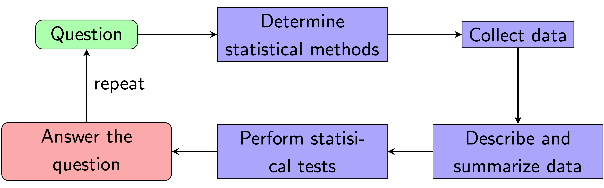

# Hypothesis testing and p-values

Before diving into statistical tests, let’s take a moment to appreciate the bigger picture.

```{r data-decisions, out.width="65%", fig.align="center", fig.cap="A pipeline for data-driven decisions.", echo=FALSE}

```

## Hypothesis testing

We often want to test our hypotheses in statistics. For example, we might create an experiment to test if a vaccine is effective at preventing COVID-19. If your results are not consistent, no one would want to use your vaccine. Here are some examples of hypotheses:

- If (*I increase the concentration of this drug*) then (*the viral particles will decrease tenfold*).
- If (*I counsel patients instead of medication*) then (*their overall mental health score will increase by 5 points*).
- If (*independent variable*) then (*dependent variable*).

In statistics, we have two types of hypotheses: the null hypothesis and the alternative hypothesis.

---

**Null hypothesis (H$_0$).** The hypothesis that there is no significant difference between specified populations (or expected value). That is, any observed difference is due to sampling or experimental error.

**Alternative hypothesis (H$_a$).** The hypothesis that the difference observed between expected and observed values are not due to chance alone.

---

Let's work through an example: A researcher thinks that if COVID-19 patients get a vaccine early after diagnosis, their recovery period will be shorter. Average recovery times for COVID patients is 2 weeks for mild cases. Thus, our hypotheses are:

- H$_0: \mu = 2$
- H$_a: \mu < 2$

If the observed average recovery times is 1 week for patients who receive a vaccine for 100 patients, then we will likely reject H$_0$. Otherwise, we do not reject H$_0$. We NEVER accept H$_0$. However, this example raises the question of when we should reject H$_0$. This is where p-values come in handy.


## P-values

---

**P-values (informal definition).** A p-value, or probability value, is the probability of the data being as extreme as it is. We use p-values to determine if our results are statistically significant. Since p-valuese are probabilities, p must be between 0 and 1 inclusive.

**P-value (formal definition).** The p-value is the probability of observing a sample as extreme or more extreme than the one observed, given that the null hypothesis is true.

---

Take a the following sleep experiment as an example. In this experiment, people try to memorize as many words as possible. Then, they are split into two groups that will either sleep 4 hours or 8 hours that night. The next day, the people try to recall as many words as possible. The following figure shows the results:

```{r p-value-sleep, out.width="50%", fig.align="center", fig.cap="Figure retrieved from [Prob(a)bilistic World](https://www.probabilisticworld.com/intuitive-explanation-p-values/).", echo=FALSE}

```

The resarcher wants to determine if there are differences between the words recalled between the two groups. What are the hypotheses that we are testing in this experiment?

<button class="collapsible">Solution</button>
<div class="collapse_content">
Let $\mu_1$ and $\mu_2$ be the average words the 4 hour of sleep group and 8 hour of sleep group receives respectively. Then,

- H$_0: \mu_1 - \mu_2 = 0$
- H$_a: \mu_1 - \mu_2 \neq 0$
</div>

<br>

Is this performance difference significant? If p = 0.01, it is likely significant. If p = 0.85, the difference is likely not significant. To compute the p-value, we will need to learn some statistical tests, which we will learn in the next chapter.

What did w learn from this example?

- A high p-value indicates a higher probability that your observations are likely to be observed.
- A low p-value indicates that your observations are NOT likely to be observed.

Check out [this article](https://towardsdatascience.com/p-values-explained-by-data-scientist-f40a746cfc8) if you want to read more about p-values.


## Significance thresholds

**Question:** What is a “high” and “low” p-value? That is, how do we determine whether something is statistically significant?

**Answer:** You get to choose when a p-value is “low enough!"

---

**Significance thresholds.** Suppose we set a significance threshold, $\alpha$. If p ≤ $\alpha$, then we can reject the null hypothesis. Otherwise, we do not reject the null hypothesis. Further, if p ≤ $\alpha$, our results are considered "statistically significant."

---

Remarks:

- A high p-value does NOT mean your null hypothesis is true. Rather, it suggests the probability of observing your measurement is high.
- To beat a dead horse, let's reiterate the following: we NEVER accept the null hypothesis.
- A confidence level is defined as $1 - $\alpha$, which tells us how uncertain we are about the true mean or median in a population.
  - For example, an [election article](https://www.rasmussenreports.com/public_content/politics/current_events/healthcare/health_care_law_aug07) “38% of likely U.S. Voters now say their health insurance coverage has changed because of Obamacare”. If you scroll down to the bottom of the article, you’ll see this line: "The margin of sampling error is +/- 3 percentage points with a 95% level of confidence."

At timese, determining significance feels arbitrary. In a sense, it is! As scientists, we have to compare our p-value against a significance threshold that we set. For example, if our p-value is 0.08:

- If $\alpha$ = 0.05, the result is not significant.
- If $\alpha$ = 0.10, the result is significant.
- If $\alpha$ = 0.08, the result is significant.

In academia, a common significance threshold is $\alpha = 0.05$. Please keep in mind that there is nothing magical about having $p < 0.05$. All it means is that there is a low probability that our observed data is less than our null hypothesis. Here is a meme I've curated for you to reinforce this concept:

```{r p-memes, out.width="75%", fig.align="center", fig.cap="Figure retrieved from [imgflip](https://imgflip.com/i/vtnlk).", echo=FALSE}

```


<script>
iFrameResize({}, ".interactive");
  
var coll = document.getElementsByClassName("collapsible");
for (var i = 0; i < coll.length; i++) {
  coll[i].addEventListener("click", function() {
    this.classList.toggle("active");
    var content = this.nextElementSibling;
    if (content.style.maxHeight){
      content.style.maxHeight = null;
      setTimeout(function() {
        content.style.paddingTop = "0";
        content.style.paddingBottom = "0";
      }, 250)
    } else {
      content.style.paddingTop = "15px";
      content.style.paddingBottom = "10px";
      content.style.maxHeight = content.scrollHeight + "px";
    } 
  });
}
</script>
