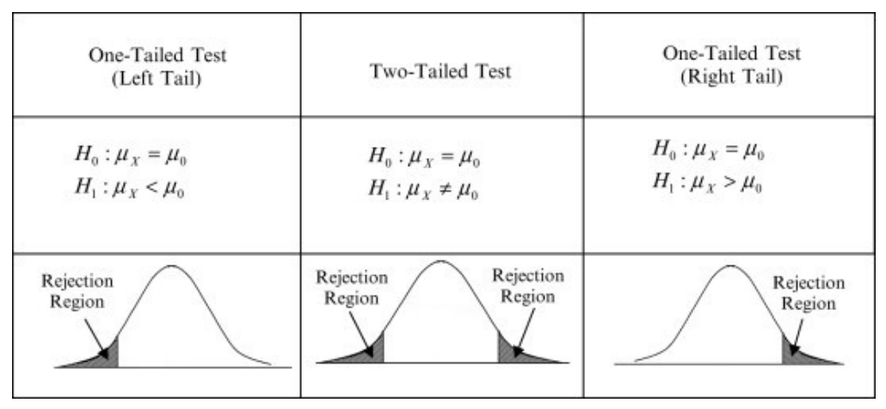
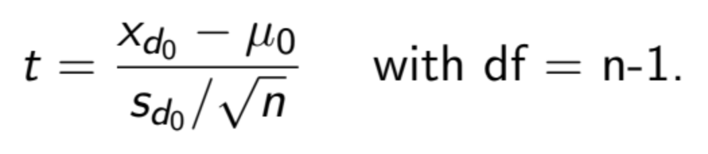
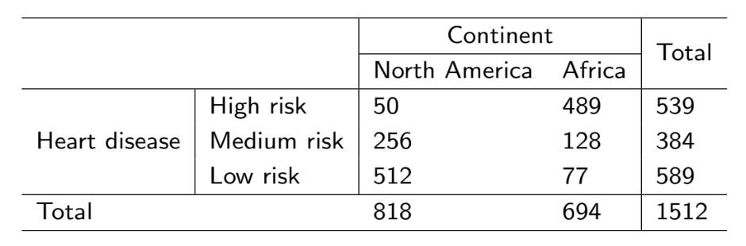
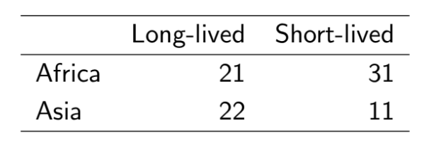

# Basic statistical tests

R contains extremely powerful tools for data science. These tools are either built-in or available from packages. Thoughout this section we hope to demonstrate best practices organizing, analyzing, and visualizing data in R.

We will again work with the gapminder dataset. Let's load the usual packages.

```{r, message = F, warning = F}
library(gapminder)
library(tidyverse)
```

When you get a new dataset, your first instinct as a good data scientist should be to explore it.

```{r}
gapminder  # also recall str(), head(), names()
```

Note the variables `country` and `continent` are considered factors (`fct`), which is a catagorical data. We can use `levels()` to observe the catagories within a factor column.

```{r}
levels(gapminder$continent)
```


## Student's t-test

---

**Student's t-test.** A t-test is used to determine if there is a significant difference between the means of two groups.

---

We use t-tests to compare means between two samples:

Given two sample means  ̄y0,  ̄y1:

**Null hypothesis (H0):** sample means are equal OR the difference between sample
means is equal to some value d0 (i.e.,  ̄y0 -  ̄y1 = d0).

**Alternative hypothesis (Ha):** sample means are not equal OR the difference between
sample means is not equal to some value d0.
There are four main “flavours” to the t-test (one-sample, equal variance, unequal
variance, pooled).


Let's start by asking the mean life expectancy of the continents in 1952. First, we'll summarize our data.

```{r}
gapminder %>% 
  filter(year == 1952) %>% 
  group_by(continent) %>%
  summarise(mean(lifeExp))
```

The life expectancy of Europe is about 64.4 years. It seems close to 65, the standard age often associated with retirement in Canada (and when full pension benefits become available!). Is this life expectancy significantly different from 65 years?


### Example 1: One sample t-test

To answer this question, we can use a one sample t-test. We will test the sample (life expectancy measured in Europe in 1952) to see if there is a significant difference between the life expectancy in Europe (64.4 years) and 65 years. Can you set up the appropriate hypotheses to test?

<button class="collapsible">Solution</button>
<div class="collapse_content">
Let $\mu$ be the average life expectancy of people in Europe in 1952. Then,

- H$_0: \mu = 65$
- H$_a: \mu \neq 65$
</div>

<br>

```{r}
Euro.life.1952 <- gapminder %>%
  filter(continent == 'Europe', year == 1952) %>%
  select(lifeExp)
t.test(Euro.life.1952, mu = 65, alternative = "two.sided")
```

Notice that p-value is 0.6144. Usually, we choose the significance threshold ($\alpha$) to be 0.05. Since p < $\alpha$, we conclude that the life expectancy of Europeans in 1952 doesn't give us evidence indicating a difference in life expectancy from 65.

We can also plot this:

```{r}
ggplot() +
  geom_histogram(aes(Euro.life.1952$lifeExp), bins=10) +
  geom_vline(xintercept = 65, col="red") +
  labs(x = "European life expectancy in 1952 (years)", y = "Count")
```

**Note:** This is NOT a figure you would include in an academic paper as the quality is quite low. We're visualizing this just so we have a better idea of what's going on with the data.


<button class="collapsible">Wilcoxon signed-rank test</button>
<div class="collapse_content">

The non-parametric test equivalent to one sample t-test is Wilcoxon signed-rank test.

```{r}
wilcox.test(Euro.life.1952$lifeExp, mu=65)
```

The non-parametric test gave us the same conclusion.

**CAUTION:** Although we obtained the same results with both the parametric t-test and non-parametric signed-rank test, their use cases are VERY different. We prefer to use parametric tests because they give us more statistical power. Only use non-parametric tests with sample sizes less than 30 and if the data is not normally distributed.

</div>


### Example 2: Two sample t-test

Does Asia and Africa differ in life expectancy in 1952? To compare two groups of data, we need a two sample t-test. Can you set up the hypotheses?

<button class="collapsible">Solution</button>
<div class="collapse_content">
Let $\mu_1$ be the average life expectancy of people in Asia in 1952. Let $\mu_2$ be the average life expectancy of people in Africa in 1952. Then,

- H$_0: \mu_1 - \mu_2 = 0$
- H$_a: \mu_1 - \mu_2 \neq 65$
</div>

<br>

```{r}
As.Af <- gapminder %>% 
  filter(year == 1952) %>% 
  filter(continent %in% c("Africa", "Asia"))
As.Af
```

We can plot this:

```{r}
ggplot(As.Af, aes(continent, lifeExp)) +
  geom_dotplot(binaxis = 'y', stackdir = 'center', dotsize=0.65) +
  geom_boxplot(alpha=0.3) +
  labs(x='Continent', y='Life expectancy (yrs)')
```

Here we want to run a two sample t-test. Before we do that, we'll need to check if the 2 samples have the same variance. Recall that different t-tests assume different variances:

  * If you assume equal variance, you would use Student's t-test.
  * If variances are unequal, use Welch's t-test.

A good rule of thumb is if the larger standard deviation (SD) divded by the smaller SD is less than 2 (SD(larger)/SD(smaller) < 2), then you can assume equal variance. Alternatively, you can test for equal variances: 

```{r, message=F, warning=F}
library(car)  # for Levene's test
leveneTest(y = As.Af$lifeExp, group = As.Af$continent)
```

Since $p = 0.0006644 < 0.05$, the two samples have significantly different variances. Indeed, the width of the boxplots in the figure above suggested this difference.

Because we have different variances, we need to use Welch's t-test. By default, `t.test()` assumes unequal variance. If this wasn't the case, we would add an additional argument called `var.equal = FALSE` to `t.test()`.

```{r}
t.test(lifeExp ~ continent, As.Af, alternative = "two.sided")
```

<button class="collapsible">Mann-Whitney U test</button>
<div class="collapse_content">

The non-parametric test equivalent to the two sample t-test in this case would be the Mann-Whitney U test.

```{r}
wilcox.test(lifeExp ~ continent, As.Af)
```

</div>


### Example 3: Paired t-test

Next, let's take a look at life expectancy in 2007:

```{r}
gapminder %>% 
  filter(year == 2007) %>% 
  group_by(continent) %>%
  summarise(meanlife = mean(lifeExp))
```

Has the life expectancy in Africa changed to that in 1952? We can answer this question with a two sample t-test. This time, we would like to match the countries.

First, let's generate a long data frame.

```{r}
Africa <- gapminder %>%
  filter(continent=="Africa") %>%
  select(country, year, lifeExp)
head(Africa)
```

Second, let's look at how the life expectancy changed over the years.

```{r}
p <- ggplot(data = Africa, aes(x = year, y = lifeExp)) +
  geom_point(aes(color = country)) +
  geom_line(aes(group = country, color=country))
show(p)
```

The change in life expectancy between 1952 and 2007 look interesting. Most of the countries have improved, while a few have decreased life expectancy.

Before testing this observation, let's reorganize our data into a nice (wide) shape.

```{r}
Africa.wide <- spread(Africa, year, lifeExp)
Africa.wide
```

The wide data frame is to align the data from the same country to the same row, so that they have the same index when we call different columns.

We can now run a paired t-test. Think about what we are testing in the code below.

```{r}
t.test(Africa.wide$'2007', Africa.wide$'1952', alternative="two.sided", paired=T)
```

Note in this process we didn't check the variance. Is this a problem? Why or why not? Recall that the paired t-test is actually a one sample t-test on paired differences.

Similarly, we could again call `wilcox.test` to run the paired version.

```{r}
wilcox.test(Africa.wide$'2007', Africa.wide$'1952', paired=T)
```

<button class="collapsible">One-tailed and two-tailed tests</button>
<div class="collapse_content">

Statistical tests can be either 1-tailed or 2-tailed depending on your question. 1-tailed
tests have 2 possibilities (having a right tail or a left tail) whereas 2-tailed tests have 1 possibility (both right and left tail).



**One-tailed tests:** If you know that life expectancy increases over time, then you would
use a 1-tailed t-test to test if life expectancy is greater in 2005 as compared to 1996.

**Two-tailed tests:** Use this if you don’t know how means should look. For example, is
the life expectancy in South Korea equal to the life expectancy in Canada?

If in doubt, use a two-tailed test. This is because significance in a two-tailed test is
“more significant” than that of the one-tailed test.

</div>


### T-test Assumptions

Since the t-test relies on a normal-like distribution, it has some assumptions.

**1. Independence assumption:** the data values should be independent.
(a) Satisfied if the data are from randomly sampled data.

**2. Normal population assumption:** the data follows a normal distribution.
(a) If n < 30, use a histogram to check that the data is unimodal and symmetric.
(b) If n ≥ 30, this assumption is fulfilled by the CLT.

**3. 10% condition:** when a sample is drawn without replacement, the sample should
be no more than 10% of the population.
• This is usually assumed to be true.

If any of these conditions are not fulfilled, consider using a non-parametric test
equivalent.

<button class="collapsible">Example Questions</button>
<div class="collapse_content">

**Question 1:** How long can car crash patients jog before and after
physiotherapy?

**Question 2:** Is the mean life expectancy in Argentina different before and
after 1980?

Here is the equation to get the test statistic:


(don’t worry too much about this)
</div>


## Chi-squared test

---

**Chi-squared test.** A chi-squared test determines if there is a significant difference between expected and observed data.

---

### $\chi^2$ test for goodness-of-fit

Let's analyze the data in Mendel's original paper: [Mendel, Gregor. 1866. Versuche über Plflanzenhybriden. Verhandlungen des naturforschenden Vereines in Brünn, Bd. IV für das Jahr
1865, Abhandlungen, 3–47.](http://www.mendelweb.org/)

<button class="collapsible">Crash course on Mendelian genetics</button>
<div class="collapse_content">

Let's (briefly) learn about [Mendelian genetics](https://www.nature.com/scitable/topicpage/gregor-mendel-and-the-principles-of-inheritance-593/) regarding dominant and recessive alleles! Recall that crossing two heterozygotes (Aa x Aa) produces offspring with dominant and recessive phenotypes with an expected ratio of 3:1.

$$\begin{array}{c|cc}
  & \mathbf{A} & \mathbf{a} \\
  \hline
  \mathbf{A} & AA & Aa \\
  \mathbf{a} & Aa & aa
\end{array}$$

Also recall that a dihybrid cross (AaBb x AaBb) produces offspring of 4 phenotypes with an expected ratio of 9:3:3:1.

$$\begin{array}{c|cccc}
  & \mathbf{AB} & \mathbf{Ab} & \mathbf{aB} & \mathbf{ab} \\
  \hline
  \mathbf{AB} & AABB & AABb & AaBB & AaBb \\
  \mathbf{Ab} & AABb & AAbb & AaBb & Aabb \\
  \mathbf{aB} & AaBb & AaBb & aaBB & aaBb \\
  \mathbf{ab} & AaBb & Aabb & aaBb & aabb
\end{array}$$

</div>

<br>

In his experiment for seed color, the F2 generation produced 6022 yellow, and 2001 green seeds. Thus, the ratio of yellow:green was 3.01:1. This ratio is not the exact theoretical ratio of 3:1. A meaningful question would be this: Is the discrepancy appeared because of random fluctuation, or is the observed ratio significantly different from 3:1?

To examine whether the observed count fits a theoretical ratio, we will use the goodness-of-fit test.

```{r}
chisq.test(x = c(6022, 2001),  # the observed data
           p = c(0.75, 0.25))  # the theoretical probability
```

A p-value of 0.9025 suggested a good match of observed data with the theoretical values. That is, the differences are not significant.

Let's assume Mendel had observed a 1000 times larger number of seeds, with the same proportion. That is, 6,022,000 yellow and 2,001,000 green. Obviously this ratio is still 3.01:1. Would it still be a good fit for the theoretical value?

```{r}
chisq.test(x = c(6022000, 2001000),   # The observed data, 1000 times larger
           p = c(0.75, 0.25))         # The theoretical probability
```

This time, p = 0.0001076, suggesting a significant deviation from the theoretical ratio. As an extension of CLT, when you sample a large enough sample, the ratio of the categories should approach the true value. In other words, $\chi^2$ test should be increasingly sensitive to small deviations when the sample size increases.


### $\chi^2$ test for independence

In another experiment, Mendel looked at two pairs of phenotypes of the F2 generation of a double-heterozygote. Below is what he saw:

  * 315 round and yellow,
  * 101 wrinkled and yellow,
  * 108 round and green,
  * 32 wrinkled and green.

Before we examine the 9:3:3:1 ratio, we want to ask if the two loci are independent of each other. That is, will being yellow increase or decrease the chance of being round (and vice versa)?

To run the $\chi^2$ test for independence, we will first need a contingency table. This time we will manually build a data frame for this purpose.

<button class="collapsible"> Contingency tables</button>
<div class="collapse_content">

Let's come back to the data of Asia and Africa in 1952. Take a look at the distribution of the life expectancy for all countries in both continents.

```{r}
summary(As.Af)
```

Notice that the median of life expectancy is 40.54. That is, half of the countries had life expectancy greater than 40.54, and the other half less than 40.54.

Let's define a catagorical variable: the countries with life expectancy > 40.54 years are "longer_lived", and the others are "shorter_lived".

```{r}
As.Af["long_short"] <- NA
As.Af$long_short[As.Af$lifeExp > 40.54] <- "longer_lived"
As.Af$long_short[is.na(As.Af$long_short)] <- "shorter_lived"
```

Now let's see if the longer lived or shorter lived variable is independent of the continent variable. We realize that both variables are categorical. In this case, we will use chi-squared test.

First, we will make a contingency table of the two variables.

```{r}
As.Af <- droplevels(As.Af)
cont <- table(As.Af$continent, As.Af$long_short)
cont
```

Here, our null hypothesis is that countries **are independent** of the continent it's a part of. Likewise, our alternative hypothesis is that countries **are dependent** (not independent) of the continent it's a part of.

```{r}
chisq.test(cont)
```

Given that $p < 0.05$, our null hypothesis that the two variables are independent is rejected. Whether a country is longer lived or shorter lived is dependent on the continent it is located in.

N.B., this is only a comparison between Africa and Asia, and does not hold true for all continents.

</div>

<br>

```{r}
Mendel2loci <- data.frame(
  yellow = c(315, 101),
  green = c(108, 32)
)

# adding rownames
rownames(Mendel2loci) <- c("round", "wrinkled")
# printing the data frame
Mendel2loci
```

Next we will run the $\chi^2$ test. The null hypothesis is that the distribution is independent of the groups.

```{r}
chisq.test(Mendel2loci)
```

The p-value of 0.8208, so we cannot reject the null hypothesis. Therefore, we should consider the two traits as independent.

Again, we could try to test for its goodness-of-fit. This time we will not need a contingency table.

```{r}
chisq.test(x = c(315, 101, 108, 32),
           p = c(9/16, 3/16, 3/16, 1/16))
```

Thus, the data fits the 9:3:3:1 ratio well.


### $\chi^2$ test for homogeneity 

The homogeneity test works the same way as an independence test -- the only difference lies in the experimentally design.

  * A test for **independence** draws samples from the *same population*, and look at two or more categorical variables.
  * A test for **homogeneity** draws sample from *2 or more subgroups of the population*, and looks at another categorical variable. The subgroup itself serves as a variable.

Recall the hypotheses for the test for homogeneity:

  * H$_0$: the distribution of a categorical response variable is the same in each subgroup.
  * H$_a$: the distribution is not the same in each subgroup.
  
Let's work through a real-life example.

<style>
  div.blue { background-color:#e6f0ff; border-radius: 10px; padding: 20px; }
</style>
<div class="blue">
  <b style="font-size: 28px;"> Remdesivir and COVID-19 </b>

  Remdesivir is an antiviral drug previously tested in animal models infected with coronaviruses like SARS and MERS. As of May 2020, remdesivir had temporary approval from the FDA for use in severely ill COVID-19 patients, and it was the subject of numerous ongoing studies.

  A randomized controlled trial conducted in China enrolled 236 patients with severe COVID-19 symptoms; 158 were assigned to receive remdesivir and 78 to receive a placebo. In the remdesivir group, 103 patients showed clinical improvement; in the placebo group, 45 patients showed clinical improvement.
  
  <a style="font-size: 12px; color: black; text-decoration: none;"> <em> A placebo is a "fake" treatment. That is, placebos do not contain any active substances that affect health. </em> </a>

  <b style="font-size: 20px;"> Reference </b>

  Wang, Y., Zhang, D., Du, G., Du, R., Zhao, J., Jin, Y., … Wang, C. (2020). Remdesivir in adults with severe COVID-19: a randomised, double-blind, placebo-controlled, multicentre trial. *The Lancet*. https://doi.org/10.1016/S0140-6736(20)31022-9
</div>

<br>

If we consider the treatment and the placebo group as two subgroups of the population, we would expect the ratios of clinical improvement to be different. Let's do a $\chi^2$ test for homogeneity. We will start with a contingency table.

```{r}
rem_cont <- data.frame(treatment = c(103, 158-103),
                       placebo = c(45, 78-45))
rownames(rem_cont) <- c("improvement", "no improvement")
rem_cont
```

Next we will run the test. Before we run the test, answer the following questions:

  * What is our null hypothesis?
  * What is our alternative hypothesis?

```{r}
chisq.test(rem_cont)
```

What does this result mean?


###  $\chi^2$ test assumptions

All statistical tests have assumptions for them to accurately represent the data. Here
are the assumptions you need to fulfill to use the chi-squared test:

**1. Counted data condition:** all data must be “counts” for the categorical variable.

**2. Independence assumption:** the counts in the cells should be independent of
each other.
(a) Satisfied if the data are from randomly sampled data.

**3. Sample size assumption:** we should expect to see at least 5 individuals in each
cell (recall CLT).
(a) If this isn’t satisfied, take your χ2 results with a grain of salt.


<button class="collapsible">Example Questions</button>
<div class="collapse_content">

**Question 1:** A study was conducted and gave the table below. We notice a trend within the data,
but how do we quantify it? Note that the numbers are counts.


Question: Is the proportion of having heart disease the same for North Americans as
it is for Africans?

**Question 2:** Is there evidence that the longevity of an individual is independent of the
continent from which the individual comes from? Let’s define long-lived as those who’s
life expectancy is greater than 40.54 and short-lived as those less than 40.54.


</div>


## Additional resources

<button class="collapsible">Fisher's exact test (OPTIONAL)</button>
<div class="collapse_content">

If the count in any cell of our contigency table is less than 5, the $\chi^2$ test will not be useful because of its probability distribution assumption. In this case, we will use Fisher's exact test.

*The hypotheses of Fisher's exact same as that of the $\chi^2$ test.* Fisher's exact test can be used for either homogeneity or independence, depending on your experimental design.

Suppose we have a sample 10 times smaller for the Remdesivir trial:

```{r}
small_rem <- data.frame(treatment = c(10, 16-10),
                       placebo = c(4, 8-4))
rownames(rem_cont) <- c("improvement", "no improvement")
small_rem
```

We have many cells with <5 observations. In this case let's run Fisher's exact test.

```{r}
fisher.test(small_rem)
```

The p-value is 0.6734. What does this result mean?

The odds ratio is yet another useful measurement you will often see in medical science articles. For the sake of time, I will leave it to you if you wish to [read up](https://www.ncbi.nlm.nih.gov/pmc/articles/PMC2938757/) on it.

</div>

<br>
  
<button class="collapsible">Comparison of proportions (OPTIONAL)</button>
<div class="collapse_content">

In the Remdesivir study, the participants were randomly assigned to each group. Thus, the groups can be treated as independent. It is also reasonable to assume independence of patients within each group.

Suppose we have two proportions $\hat{p}_1$ and $\hat{p}_2$. Then, the normal model can be applied to the difference of the two proportions, $\hat{p}_1 - \hat{p}_2$, if the following assumptions are fulfilled:

  * The sampling distribution for each sample proportion is nearly normal.
  * The samples are independent random samples from the relevant populations and are independent of each other.

Each sample proportion approximately follows a normal model when $n_1p_1$, $n_1(1 - p_1)$, $n_2p_2$, and $n_2(1-p_2)$ are all are $\geq 10$. To check success-failure in the context of a confidence interval, use $\hat{p}_1$ and $\hat{p}_2$.

The standard error of the difference in sample proportions is
\[\sqrt{\dfrac{p_1(1-p_1)}{n_1} + \dfrac{p_2(1-p_2)}{n_2}}. \]

For hypothesis testing, an estimate of $p$ is used to compute the standard error of $\hat{p}_1 - \hat{p}_2$: $\hat{p}$, the weighted average of the sample proportions $\hat{p}_1$ and $\hat{p}_2$,
\[\hat{p} = \dfrac{n_1\hat{p}_1 + n_2\hat{p}_2}{n_1 + n_2} = \dfrac{x_1 + x_2}{n_1 + n_2}. \]

To check success-failure in the context of hypothesis testing, check that $\hat{p}n_1$ and $\hat{p}n_2$ are both $\geq 10$.

In this case, let's calculate the The pooled proportion $\hat{p}$:
    \[\hat{p} = \dfrac{x_1 + x_2}{n_1 + n_2} = 0.627\]

```{r}
x = c(103, 45)
n = c(158, 78)
p.hat.vector = x/n
p.hat.vector

# use r as a calculator
p.hat.pooled = sum(x)/sum(n)
p.hat.pooled
```

Next we will check the success-failure condition, which is, $\hat{p}n_1$ and $\hat{p}n_2$ are both $\geq 10$. 

```{r}
# check success-failure
n*p.hat.pooled
n*(1 - p.hat.pooled)

```

The success-failure condition is met; the expected number of successes and failures are all larger than 10.

```{r}
# conduct inference
prop.test(x = x, n = n)
```

In this example, we tested $H_0: p_1 = p_2$ against $H_a: p_1 \neq p_2$ Here,

  * $p_1$ represents the population proportion of clinical improvement in COVID-19 patients treated with remdesivir, and
  * $p_2$ represents the population proportion of clinical improvement in COVID-19 patients treated with a placebo.
  
By convention, $\alpha = 0.05$. The $p$-value is 0.3284, which is greater than $\alpha$. 

We conclude that there is insufficient evidence to reject the null hypothesis. Although the proportion of patients who experienced clinical improvement about 7% higher in the remdesivir group, this difference is not big enough to show that remdesivir is more effective than a placebo.

</div>
  
<br>

<button class="collapsible">Visualizing data distributions (OPTIONAL)</button>
<div class="collapse_content">

  We've barely scratched the surface of `dplyr` but I want to point out key things you may start to appreciate.
  
  dplyr's verbs, such as `filter()` and `select()`, are what's called [pure functions](http://en.wikipedia.org/wiki/Pure_function). To quote from Wickham's [Advanced R Programming book](http://adv-r.had.co.nz/Functions.html):

  > The functions that are the easiest to understand and reason about are pure functions: functions that always map the same input to the same output and have no other impact on the workspace. In other words, pure functions have no side effects: they don't affect the state of the world in any way apart from the value they return.
  And finally, the data is **always** the very first argument of every dplyr function.

Knowing the properties of the normal distribution is essential in understanding the normal distribution. The position of the peak indicates the mean, whereas the spread of the curve indicates the variance.

Although you might not think your data follows a bell curve, let's take a look at this example for our exercise. Let's first install a package that helps us create [ridgeline plots](https://www.data-to-viz.com/graph/ridgeline.html).

```{r, eval=F}
install.packages("ggridges")
```

Here we will plot the distribution of the life expectancy of African countries in different years. For each year, distributions are sectioned into quartiles. What could you say about the trend over the years? Please discuss both the mean and variance. What does it mean?

```{r}
library(ggridges)

# getting all rows with Africa as the continent
Africa.all <- gapminder %>% filter(continent == "Africa", year > 1990)
# plotting
p <- ggplot(Africa.all, aes(lifeExp, as.factor(year), fill=factor(stat(quantile)))) +
  stat_density_ridges(quantiles=4,
                      quantile_lines=T,
                      geom = 'density_ridges_gradient') +
  scale_fill_viridis_d(name='Quartile') +
  labs(x='Life expectancy (yrs)', y='Year') +
  theme_classic()
show(p)
```

Let's take a look at the mean and standard deviation to see if your guess is correct.

```{r}
Africa.all %>% 
  select(c(year, lifeExp)) %>%
  group_by(as.factor(year)) %>%
  summarize(mean_life = mean(lifeExp), sd_life = sd(lifeExp))
```

This visualization shows the same information as that in with the density plots, but in a more digestible manner.

```{r}
p <- ggplot(data = Africa.all, aes(x=as.factor(year), y=lifeExp)) +
  geom_dotplot(binaxis = 'y', stackdir = 'center', binwidth = 1) +
  geom_boxplot(alpha=0.3)
show(p)
```

You may want to remove the gray background and decrease dot size. This is as easy as specifying the `dotsize` parameter and adding `theme_classic()`. There a lot more themes out there! Check them out [here](https://ggplot2.tidyverse.org/reference/ggtheme.html).

```{r}
p <- ggplot(data = Africa.all, aes(x=as.factor(year), y=lifeExp)) +
  geom_dotplot(binaxis = 'y', stackdir = 'center', binwidth = 1, dotsize = 0.65) +
  geom_boxplot(alpha=0.3) + 
  theme_classic()
show(p)
```

While we're at it, let's also rename the x- and y-axis. Since we've saved the plot already, let's add a label layer to the plot.

```{r}
p <- p + labs(x = 'Year', y = 'Life expectancy (yrs)')
show(p)
```

Now this figure is publication-ready.
  
</div>
  

<script>
iFrameResize({}, ".interactive");
  
var coll = document.getElementsByClassName("collapsible");
for (var i = 0; i < coll.length; i++) {
  coll[i].addEventListener("click", function() {
    this.classList.toggle("active");
    var content = this.nextElementSibling;
    if (content.style.maxHeight){
      content.style.maxHeight = null;
      setTimeout(function() {
        content.style.paddingTop = "0";
        content.style.paddingBottom = "0";
      }, 250)
    } else {
      content.style.paddingTop = "15px";
      content.style.paddingBottom = "10px";
      content.style.maxHeight = content.scrollHeight + "px";
    } 
  });
}
</script>
